

 

ako pronađeš grešku pošalji email na matej . ciglenecki2 at gmail . com

<button id="run_system">Show / hide questions</button>

### Signali

Definirajte osnovne signale (sinusoida, eksponencijala, jedinična stepenica i jedinični impuls).

Sinusoida/kosinusoida:
$x(t) = Asin(\Omega t + \phi)$
$x[x] = Asin(\omega n + \phi)$

$A$ je amplitda
$\Omega$ ili $omega$ je frekvencija signala
$\phi$ je faza

Reprezetnacija sinunsoide:
$x(t)=A \sin (\Omega t+\phi)=a \sin (\Omega t)+b \cos (\Omega t)$

$\begin{aligned} & a=A \cos (\phi) \\ & b=A \sin (\phi)\end{aligned}$
$\phi=\operatorname{atan} 2(b, a)$

Eksponencijalna funkcija
$x(t) = Ae^{st}, \quad A,s \in \mathbb{C}$
$x[n] = Az^{n}, \quad A,z \in \mathbb{C}$

Veza između diskretne i kont. eksponencijale: $z = e^{sT}$

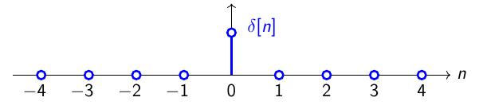
$\delta[n]= \begin{cases}1, & n=0 \\ 0, & \text { inače} \end{cases}$

Jedinični impuls (Kroneckova delta funckija)

Jedinična stepenica:

$\mu[n] = \begin{cases}1, & 0 \le n \\ 0, & \text{inače} \end{cases}$

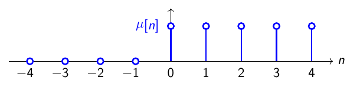

Veza između Kroneckove delta funkcije i jedinične stepenice:
sumacija od $-\infty$ do $n$ po $\delta[m]$

$\mu[n] = \sum\limits_{m=-\infty}^{n}\delta[m]$

(1) Objasnite dekompoziciju signala u težinsku sumu baznih funkcija (2) Objasnite što je spektar signala. (3) Definirajte matricu baznih funkcija, Gramovu matricu i transforamcijsku matricu koju koristimo za računanje spektra nekog signala konačnog trajanja.

Signal rastavljamo u njegove gradivne komponente koje se sastoje od drugih signala (bazne funkcije $\phi_k(t)$) a spektar ($s_k$) označava doprinos pojedine bazne funkcije.

Rastav signala na bazne funckije i njihov spektar može sadržavati prebrojivo ili neprebrojivo mnogo baznih funckija.

$x(t) = \sum_{k}s_k\phi_k(t)$

Najpoznatnija metoda rastava signala je Fourierova transformacija.

Skalarnim umnoškom možemo pronaći spektar $s_k$ na način da primjenimo skalarni umnožak na gornju jednadžbu nakon čega dobivamo sljedeći izraz: 

$\left\langle x[n], \phi_l[n]\right\rangle=\left\langle\sum_k s_k \phi_k[n], \phi_l[n]\right\rangle$

$$
\underbrace{\left[\begin{array}{c}
\left\langle x, \phi_0\right\rangle \\
\left\langle x, \phi_1\right\rangle \\
\vdots \\
\left\langle x, \phi_{N-1}\right\rangle
\end{array}\right]}_{\mathrm{b}}=\underbrace{\left[\begin{array}{ccc}
\left\langle\phi_0, \phi_0\right\rangle & \cdots & \left\langle\phi_{N-1}, \phi_0\right\rangle \\
\left\langle\phi_0, \phi_1\right\rangle & \cdots & \left\langle\phi_{N-1}, \phi_1\right\rangle \\
\vdots & \ddots & \vdots \\
\left\langle\phi_0, \phi_{N-1}\right\rangle & \cdots & \left\langle\phi_{N-1}, \phi_{N-1}\right\rangle
\end{array}\right]}_{\mathrm{G}} \underbrace{\left[\begin{array}{c}
s_0 \\
s_1 \\
\vdots \\
s_{N-1}
\end{array}\right]}_{\mathrm{s}},
$$

Primjetiti da je $G = \Phi^{H} * \Phi$. Sad možemo izraziti spektar kao:

$\begin{aligned}\\s = G^{-1}b = & \\
G^{-1}(x^T\Phi^*)^T = & \\
G^{-1}\Phi^{H}x = & \\
(\Phi^H\Phi)^{-1}\Phi^Hx = & \\
\Phi^{+}x = & \\
Tx \quad &\end{aligned}$

gdje:

$\begin{aligned} x^T & =\left[\begin{array}{llll}x[0] & x[1] & \cdots & x[N-1]\end{array}\right] \\ \phi_k^T & =\left[\begin{array}{llll}\phi_k[0] & \phi_k[1] & \cdots & \phi_k[N-1]\end{array}\right] \\ \Phi & =\left[\begin{array}{llll}\phi_0 & \phi_1 & \cdots & \phi_{N-1}\end{array}\right] \\ T & =  \Phi^{+} = (\Phi^H\Phi)^{-1}\Phi^{H} \end{aligned}$

Operacija $^*$ konjugira sve elemente matrice. Konjugirana matrica je ista matrica kao i originalna ali svi kompleksni brojevi imaju promjenjeni predznak +-.

Operacija $^{H}$ daje hermatski transponiranu matricu(matrica koja je konjugirana i transponirana)

Operacija $^{+}$ je Moore-Penrosev  psuedoinverz matrice (učili na strojnom učenju)

Definirajte diskretnu Fourierovu transformaciju u N točaka (DFTN).

Fouriervoa baza ($DTF_N$) je
$\phi_k[n]=\exp \left(2 \pi j \frac{n k}{N}\right)$ i također je ortogonalna

Spektar (DTFN):
$X[k]=\left\langle x[n], \phi_k[n]\right\rangle=\sum\limits_{n=0}^{N-1} x[n] \exp \left(-2 \pi j \frac{n k}{N}\right)$

Signal (IDFTN):
$x[n]=\frac{1}{N} \sum\limits_{k=0}^{N-1} X[k] \exp \left(2 \pi j \frac{n k}{N}\right)$

Definirajte postupak očitavanja signala te iskažite teorem o očitavanju.

Očitavanje/uzorkovanje/otpikavanje kontinuiranog signala $x(t) : \mathbb{R} \rightarrow \mathbb{C}$ jest
postupak uzimanja jednoliko vremenski razmaknutih uzoraka tog signala. Jednoliki vremenski razmak između uzoraka zovemo period očitavanja i označavamo s $T_s$.

Signalu $x(t)$ pridružjemo uzorke $y[n]$

$$y[n] = x\left(n T_s\right)$$ što se može čitati "uzorak $y[n]$ u koraku n sadrži vrijednost signala $x(t)$ u trenutku $t=nT_s$

Ako uz zadovoljen uvjet teorema očitavanja uzorci signala jednoznačno opisuju signal onda to znači da mora postojati postupak rekonstrukcije signala iz njegovih uzoraka. Taj postupak zovemo interpolacija.

Međutim, želimo vremenski kont. signal $x(t)$ i njegove uzorke $x[n]$ prikazati u istoj domeni. To radimo tako da uvedemo novi kont. signal $x_s(t) : \mathbb{R} \rightarrow \mathbb{C}$ koji sadržava istu informaciju kao i $x[n]$. To je zapravo kontinuirana verzija očitanog signala $x[n]$. Logički gledajući situacija je sljedeća:

$x(t) \rightarrow \text{očitavanje} \rightarrow x_s(t) \rightarrow \text{diskretizacija} \rightarrow x[n]$

Mora biti $x_s(t) = 0, \quad t \ne nT_s$ jer gubimo sve informacije na tim mjestima.

Očitavanje na mjestima na kojima želimo radimo sa Diracovom delta funkcijom.

$x_s(t)= \begin{cases}x[n] \delta\left(t-n T_s\right), & \text { za } t=n T_s \\ 0, & \text { za } t \neq n T_s\end{cases}$

Za jednostavniju interpretaciju koristimo Diracov češalj (periodizirane Diracove delta funkcije)

$\operatorname{comb}_{T_s}(t)=\sum\limits_{k=-\infty}^{+\infty} \delta\left(t-k T_s\right)$

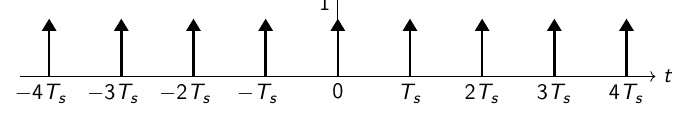

Sad originalan signal $x_s(t)$ ponožimo sa Diracovim češljem

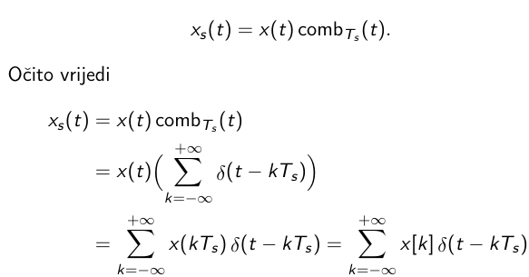
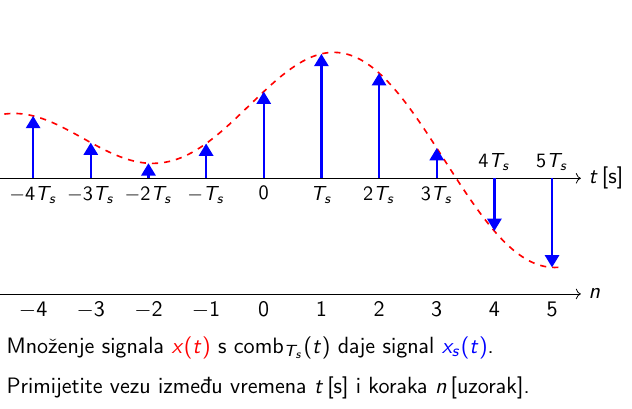

Što je sa spektrom? Kako se on očitava?

Spektar $X_s({\Omega})$ očitanog signal $x_s(t)$ iz spektra $X(\Omega)$ izvornog signala $x(t)$ dobivamo kao:

$$X_s(\Omega)=\frac{1}{T_s} \sum_{k=-\infty}^{+\infty} X\left(\Omega-k \Omega_s\right)$$

što je periodizacija spektra

Definirajte postupak rekonstrukcija signala iz uzoraka te iskažite idealnu interpolacijsku formulu.

Ako uz zadovoljen (za sada nedefinirani) uvjet teorema očitavanja uzorci signala jednoznačno opisuju signal onda to znači da mora postojati postupak rekonstrukcije signala iz njegovih uzoraka. Taj postupak zovemo interpolacija.

Za rekonstrukciju u **spektralnoj domeni** potrebno je zadovoljiti Nyquistov uvjet. Za pojasno ograničene signale maksimalne frekvencije $\Omega_{\text{MAX}}$ nema preklapanja spektra ako je zadovoljen uvjet

$$ \Omega_s > 2\Omega_{\text{MAX}} \quad \text{ili} \quad T_s < \frac{\pi}{\Omega_{\text{MAX}}}$$

Jednostavnije: frekvencije očitavanja ($\Omega_S$) mora biti duplo veća od maksimalne frekvencije $\Omega_{\text{MAX}}$

Ako je Nyquistov uvjet zadovoljen iz pozantog spektra $X_s(\Omega)$ možemo odrediti polazni spektar $X(\Omega)$ tako da:
- spektar pomnožimo s $T_s$
- ostavimo samo temeljni period oko ishodišta koji je duljine $\Omega_s$

Taj postupak se zove filtracija a matematički se može zapisati kao:

$$ X(\Omega)  = X_s(\Omega) \cdot T_s \text{ rect}\left(\frac{\Omega}{\Omega_s}\right) = X_s(\Omega) \cdot F(\Omega)$$

gdje je spektar $F(\Omega)$: 
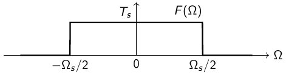

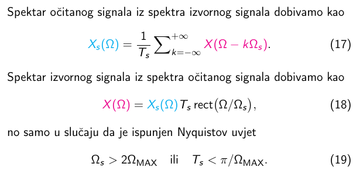

### Veza filtracije i konvolucije

Konvolucija $(*)$ :

$x[n] * y[n]=\sum_{m=-\infty}^{+\infty} x[m] y[n-m]$

Konvolucija u vremenskoj domeni rezultira množenjem u spektralnoj domeni.

$x[n] * y[n] \quad \bigcirc - \bullet \quad  X(z)Y(z)$
$x(t) * y(t)=\int_{-\infty}^{+\infty} x(\tau) y(t-\tau) d \tau$

Sad se mogu dva spektra pomnožiti (spektar se definira kao integral originalnog signala pomnožen sa $e^{-j\Omega t}$) čime se dobiva izraz u kojem središnji integral sadržava definiciju konvolucije dva signala. Jedan signal je $x_s(t)$ a drugi je signal koji "tražimo" je $f(t)$. Taj signal možemo izračunati tako da napravimo inverz (ICTFT) njegovog poznatog spektra $F(\Omega)$ koji je definiran gore. Inverz ispadne $f(t) = \frac{\text{sin}(\frac{\pi t}{T_s})}{\frac{\pi t}{T_s}} = \text{sinc}(t)$

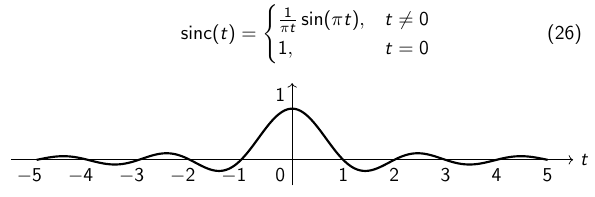

Sad znamo da spektralna filtracija postaje konvolucija u vremenskoj domeni:

$X(\Omega)=X_s(\Omega) F(\Omega)=X_s(\Omega) T_s \operatorname{rect}\left(\Omega / \Omega_s\right)$

$x(t)=x_s(t) * f(t)=x_s(t) * \operatorname{sinc}\left(t / T_s\right)$

Dodatno, $x_s(t) = x(t)\text{comb}_{T_s}(t)$

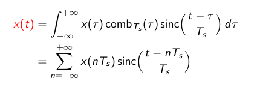

Shannonova interpolacijska formula ili jednostavnije idealnom sinc interpolacijom.

$x(t)=\sum_{n=-\infty}^{+\infty} x[n] \operatorname{sinc}\left(\frac{t}{T_s}-n\right)$

Formula nam u osnovi govori da kontinuirani signal rekonstruiramo tako da na mjesto svakog uzorka postavimo funkciju sinc skaliranu tako da njena amplituda bude upravo jednaka amplitudi uzorka.

### Sustavi

Definirajte sustav preko ulazno/izlaznog modela. 

Ulazne veličine $x[n]$ su one koje utječu na vladanje sustava i zovemo ih **pobudom**.
Izlazne veličine $y[n]$ su one kojima sustav utječe na vanjski svijet i zovemo ih **odzivom**. Oboje su vremenske funkcije koje ovise o nezavisnoj varijabli koja mjeri vrijeme.

Sustav prema tome možemo opisati tako da modeliramo kako
ulazne veličine utječu na izlazne veličine.

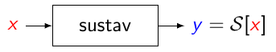

Sustav $\mathcal{S}$ koja povezuje ulaz $x$ i izlaz $y$. Kažemo da je $y[n]$ odziv sustava $\mathcal{S}$ na pobudu $x[n]$

$$ y = \mathcal{S}[x] $$

Primjeri sustava:

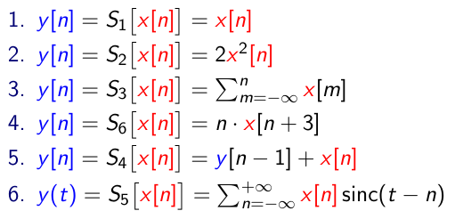

Definirajte linearni vremenski nepromjenjiv (LTI) sustav te objasnite svojstva linearnosti i vremenskenepromjenjivosti.

Malo šire o svojstvima sustava:
- vremenska nepromjenjivost (engl. time invariance)
- linearnost (engl. linearity)
- posjedovanje memorije (engl. systems with memory)
- kauzalnost (engl. causality)
- stabilnost (engl. stability)
- realizabilnost (engl. realizability)

### Vremenska nepromjenjivost

Sustav je vremenski nepromjenjiv ako za svaki ulazno-izlazni par signala $x[n]$ i $y[n]$ te za svaki pomak $m$ vrijedi da je odziv na zakašnjelu/pomaknutu pobudu $x[n-m]$ jednak zakašnjelom/pomaknutom odzivu $y[n-m]$

$$ \forall{\left(x[n], y[n]\right)}, \forall{m} \in \mathbb{Z} : \mathcal{S}[x(n-m)] = y(n-m) $$

U praksi smjer pomaka prema budućnosti je nemoguć jer to znači da ovisimo o budućim uzorcima signala.

### Linearnost i superpozicija

Svojstvo linearnosti sastoji se od:
1. svojstva aditivnosti
2. svojstvo homogenosti

a sustavi koji su linearni zadovoljavaju svojstvo superpozicije.

Linearno vremenski nepromjenjivi (LTI) sustavi su oni koji zadovoljavaju svojstvo:
- linearnosti
  - aditivan
  - homogen
- vremenske nepromjenjivosti

### Aditivnost

Promatramo dva ulazna signala $x_1[n], x_2[n]$. Svaki od njih ima svoj odziv $y_1[n], y_2[n]$ koji se dobije tako da provućemo ulazni signal kroz sustav $\mathcal{S}$. Ako napravimo sljedeće:
- zbrojimo $x_1[n] + x_2[n] = x[n]$
- $x[n]$ provućemo kroz kroz sustav $\mathcal{S}$ i dobijemo odziv $y[n]$

ako je odziv $y[n]$ jednak zbroju pojedinih odziva $y_1[n], y_2[n]$ onda kažemo da je sustav aditivan (mora vrijediti za svaki ulazno-izlazni par signala)

$$ \forall{\left(x_1[n], y_1[n]\right)}, \forall{\left(x_2[n], y_2[n]\right)}:\\
\mathcal{S}[x_1[x] + x_2[n]] = y_1[n] + y_2[n] $$

### Homogenost

Sustav je homogen ako ulazni signal pomnožimo sa $a \in \mathbb{C}$ a odziv bude pojačan upravo sa $a$ (ovisi je li $|a| < 1$ ili $|a| > 1$)

$$ \mathcal{S}[a\cdot x[n]] = a \cdot y[n]$$

### Linearnost

Sustav je linearan ako je aditivan i homogen za svaki ulazno-izlazni par:

$$\forall{\left(x_1[n], y_1[n]\right)}, \forall{\left(x_2[n], y_2[n]\right)}: \\
\mathcal{S}[ax_1[n]+bx_2[n] = ay_1[n] + by_2[n]$$ 

Definirajte kauzalnost sustava

Prije svega, želimo predstaviti sustav $\mathcal{S}$ sa funkcijom $f$ koja definira kako se računa jedan izlazni uzorak $y[n]$ u koraku $n$ a općenito ta funckija može ovisti o više ulaznih uzoraka ($x[-\infty], ... ,x[n],...x[+\infty]$), dakle:

$$ y[n] = f_n((x[-\infty], ... ,x[n],...x[+\infty])) $$
$$ f_n : \mathbb{C^Z} \rightarrow \mathbb{C} $$

Međutim želimo ograničiti broj uzoraka koji je potreban za računanje odziva na neku konačnu vrijednost (računala...)

Dva svojstva koja ograničavaju broj uzoraka su:
- (ne)posjedovanje memorije
  - bezmemorijski sustavi
  - memorijski sustavi
- kauzalnost

### Bezmemorijski sustav

Sustav je bezmemorijski ako računamo odziv sustava u koraku $n$ ($y[n]$) i za računanje odziva moramo znati samo vrijednost $x[n]$.

$$ y[n] = \mathcal{S}[x[n]] = f(x[n]) $$
### Memorijski sustav 

Sustav je memorijski ako za računanje odziva sustava u koraku $n$ ($y[n]$) trebamo znati ulazni signal koji se NIJE dogodio u trenutku $n$ već u nekom drugom trenutku $m$. Dakle $m \ne n$.Red sustava je konačan broj ulaznih uzoraka $m$ o kojem ovisi pobuda $n$.

$$ y[n] = S[x[n]] = f(...,x[m],...) $$

Primjer memorijskog sustava prvog reda. Ovaj sustav ovisi o samo jednom dodatnom uzorku osim $x[n]$ a to je $x[n-1]$:

$$ y[n] = x^2[n] + x^2[n-1] $$

### Kauzalnsot

Kauzalnost u općem smislu jest veza koja opisuje kako neki događaj kojeg zovemo uzrok utječe na neki drugi događaj kojeg zovemo posljedica.

U obradbi signala **kauzalnost** sustava znači da **odziv sustava ne smije ovisiti o pobudi sustava koja se još nije dogodila.**

Odziv $y[n]$ u koraku $n$ smije ovisiti samo o pobudama $x[m]$ za koje vrijedi $m \le n$:

$$ y[n] = f_n(x[-\infty],..., x[n-1], x[n])$$

Formalno (Sustav je kauzalan ako ne postoji budući korak $m > n$ takav da je izlaz sustava $y[n]$ ovisan o budućoj ulaznoj vrijednosti $x[m]$ u tom budućem koraku $m$):

$$ \forall{n}\forall{y(n)} \nexists{m>n} : y[n] = f(...,x[m],...) $$

## Nekauzalnost

Nekauzalan sustav je sustav koji nije kauzalan. Dakle, sustav čija pobuda $y[n]$ može ovisiti o ulazima $x[m]$ za koje vrijedi $m > n$ (trenutak ulaznih signala se dogodio nakon trenutka pobuda).

Definirajte impulsni odziv sustava i objasnite važnost konvolucije u modeliranju LTI sustava.

Impulsni odziv sustava je skup odziva koji su pomaknuti sa jediničnim impulsom $\delta[n-k]$ a označavamo ih sa $h_k[n] = \mathcal{S}[\delta[n-k]]$

Skup svih $h_k[x]$ u potpunosti određuje sustav $\mathcal{S}$.

Bitno je napomenuti da je $\delta[n]$ svojstvena funckija a linearni sustav koji koristi svojstvenu funkciju ne mijenja ulazni signal $x[n]$ osim što ga eventualno amplitudno skalira.

### Konvolucija i odziv sustava

$$
y[n]=\mathcal{S}[x[n]]=\sum_{k \in \mathbb{Z}} x[k] \mathcal{S}[\delta[n-k]]=\sum_{k \in \mathbb{Z}} x[k] h_k[n]
$$

Odziv na $\delta[n]$ za $k=0$ bez pomaga je upravo $\mathcal{S}[\delta[n]] = h_o[k]$ a zbog vremenske nepromjenjivosti sustava imamo:

$$\mathcal{S}[\delta[n-k]]=h_k[n]=h_0[n-k]$$

Sad možemo ispustiti $-k$ i koristiti samo $h_0[n]$ tj. $h[n]$

Sad za linearni vremenski nepromjenjivi sustav dobivamo konvoluciju: 

$$ y[n]=\mathcal{S}[x[n]]=\sum\limits_{k=-\infty}^{+\infty} x[k] h[n-k] = x[n] * h[n] $$

Pomoću konvolucije možemo opisati ponašanje svakog linearnog vremenski nepromjenjivog sustava.

Rezime:

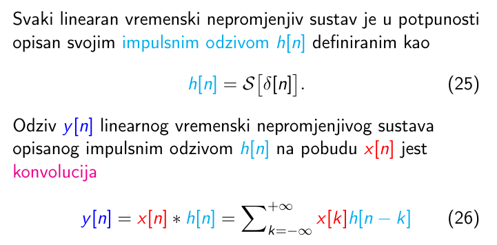

### Dodatno: kauzalni linearni vremenski nepromjenjivi sustavi 

Linearan vremenski nepromjenjiv sustav S opisan svojim impulsnim odzivom $h[n]$ je kauzalan ako je $h[n] = 0$ za sve negativne korake $n$.

Konvolucija za kauzalne signale za koje vrijedi $x[n] = h[n] = 0$ za $n < 0$ se reducira u konačnu sumu:

$$
x[n] * h[n]=\sum_{k=0}^n x[k] h[n-k]
$$

Dakle sve je isto samo što suma ide od $0$ do $n$

Objasnite što je prijenosna funkcija sustava.

Dodatan način reprezentacije LTI sustava

Krećemo od Z transformacija koje djeluje na konvolucije:

$$
\begin{aligned}
\mathcal{Z}[y[n]] & =\sum_{n \in \mathbb{Z}} y[n] z^{-n}=Y(z), & r_y<|z|<R_y \\
\mathcal{Z}[x[n]] & =\sum_{n \in \mathbb{Z}} x[n] z^{-n}=X(z), & r_x<|z|<R_x \\
\mathcal{Z}[h[n]] & =\sum_{n \in \mathbb{Z}} h[n] z^{-n}=H(z), & r_h<|z|<R_h
\end{aligned}
$$

presjek njihovih područja konvergencije je određen s

$$ r = max(r_y, r_x, r_h) < |z| < min(R_y, R_x, R_h) $$

ako su svi signali kauzalni rasta ne većeg od eksponencijalnog onda $R_{\{y,x,h\}} \rightarrow +\infty$ pa je područje konvergencije (RoC) uvijek neprazan oblika $ r < |z| $.

Kako Z transformacija konvoluciju pretvara u množak imamo:

$$
Y(z)=\mathcal{Z}[y[n]]=\mathcal{Z}[x[n] * h[n]]=X(z) H(z)
$$

Obzirom da impulsni odziv $h[n]$ u  otpunosti opisuje LTI sustav isto to vrijedi i za njegovu Z transformaciju H(z).

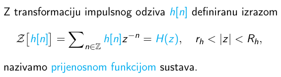

Sad imamo tri glavne zadaće a mi promatramo uglavnom konvolucijsku zadaću:

$$
\begin{aligned}
& Y(z)=X(z) \cdot H(z) & \text{konvolucijska zadaća} \\
& X(z)=Y(z) \cdot \frac{1}{H(z)} & \text{dekonvolucijska zadaća} \\
& H(z)=Y(z) \cdot \frac{1}{X(z)} & \text{identifikacija sustava}
\end{aligned}
$$

Odziv LIT sustava na diskretnu eksponencijalu $x[n] = z^n$ je;

$$
\begin{aligned}
y[n] & =\mathcal{S}\left[z^n\right]=\sum_{m=-\infty}^{+\infty} h[m] z^{n-m} \\
& =z^n \underbrace{\sum_{m=-\infty}^{+\infty} h[m] z^{-m}}_{H(z)}=z^n H(z)
\end{aligned}
$$

gdje je $H(z)$ prijenosna funkcija sustava. Diskretna eksponencijala $z^n$ jest svojstvena funckija LIT sustava i konvolucijske sume a **$H(z)$** je pripadna **svojestvena vrijednost**:

$$
\mathcal{S}\left[z^n\right]=h[n] * z^n=H(z) \cdot z^n
$$

Objasnite što je frekvencijska karakteristika sustava.

Ukoliko zamjenimo Z transformaciju sa DTFT-om dobivamo:

$$
Y\left(e^{j \omega}\right)=\operatorname{DTFT}[y[n]]=\operatorname{DTFT}[x[n] * h[n]]=X\left(e^{j \omega}\right) H\left(e^{j \omega}\right)
$$

DTFT transformacija impulznog odziva $h[n]$ daje $H(e^{jw})$ što i dalje u potpunosti određuje LTI sustav pa vrijedi da je **frekvencijska karakteristika sustava** jednaka:

$$
\operatorname{DTFT}[h[n]] = \sum_{n \in \mathbb{Z}} h[n]e^{-j\omega} = H(e^{j\omega})
$$

**ako RoC prijenosne funkcije H(z) obuhvaća jediničnu kružnicu.**

Definirajte stabilnost sustava i objasnite kako ispitujemo je li linearan vremenski nepromjenjiv sustavstabilan.

Sustav je (BIBO, bounded-input, bounded-output) stabilan ako za svaku amplitudno ograničenu pobudu daje amplitudno ograničeni odziv.

Signal $f[n]$ je amplitudno ograničen ako postoji broj $B$ takav da vrijedi

$$\forall{n \in \mathbb{Z}}, \exist{B} \in \mathbb{R}^+ : \quad |f[n]| < B $$

Dakle sustav $\mathcal{S}$ je stabilan ako za svaki ulaz $x[n]$ koji za koji vrijedi $|x[n]| < B_x$ postoji pozitivna konstanta $k$ takva da:

$$ |S[x[n]]| = |y[n]| < k \cdot B_x = B_y $$

### Stabilnost preko impulsnog odziva

Neka je $x[n]$ amplitudno ograničen sa konstantom $B_x$:

$|y[n]| = |\sum_{m \in \mathbb{Z}} h[m]x[m-n]| \le  \sum_{m \in \mathbb{Z}}|h[m]x[m-n]| = B_x\underbrace{\sum_{m \in \mathbb{Z}}|h[m]|}_{=k} = B_y$

LTI sustav određen impulsnim odzivom $h[n]$ je BIBO stabilan ako $\sum_{n \in \mathbb{Z}}|h[n]| < +\infty$

### Stabilnost preko prijenosne funckije

$$
\left|H\left(e^{j \omega}\right)\right|=\left|\sum_{n \in \mathbb{Z}} h[n] e^{j \omega n}\right| \leq \sum_{n \in \mathbb{Z}}|h[n]| \cdot\left|e^{j \omega n}\right|=\sum_{n \in \mathbb{Z}}|h[n]|
$$

ako je LTI sustav stabilan onda područje konvergencije prijenosne funckije $H(z)$ sadrži jediničnu kružnicu $z=e^{jw}$

### LTI stabilnost konkretno

Područje konvergencije stabilnog LTI sustava mora sadržavati jediničnu kružnicu pa je $r_{\text{max}} = \max\limits_{k}|p_k| < 1$

Vremenski diskretan LTI sustav opisan linearnom diferencijskom jednadžbom sa stalnim koeficijentima je stabilan **ako se svi polovi njegove prijenosne funkcije nalaze unutar jedinične kružnice.**

### Filtracija

Objasnite što je filtracija signala.

Filtracija je postupak u kojem se dizajniraju sustavi koji propuštaju i/ili prigušavaju odredene frekvencije signala. To je postupak uklanjanja neželjenih značajki ili komponenta signala. Najčešće to znači uklanjanje nekih frekvencija ili frekvencijskih pojaseva.

Dizajniranje filtra znači odrediti koeficijente prijenosne funkcije digitalnog filtra koje zadovoljavaju zadanu filtarsku specifikaciju. Tu zadaću pronalaženja filtarskih koeficijenata nazivamo računalnom podržani dizajn filtara. Glavni problem kod dizajniranja filtra jest određivanje koeficijenata prijenosne funkcije:

$$H(z)={Y(z)\over X(z)}={b_0+b_1z^{-1}+b_2z^{-2}+\cdots+b_{M}z^{-M}\over1+a_1z^{-1}+a_2z^{-2}+\cdots+a_Nz^{-N}}={\displaystyle\sum_{j=0}^{M}b_jz^{-j}\over\displaystyle1+\sum_{i=1}^{N}a_iz^{-i}}=b_0\frac{\prod\limits_{m=1}^M (1 - z_m z^{-1}) }{\prod\limits_{m=1}^N (1 - p_m z^{-1})}$$

takvih da frekvencijska karakteristika filtra $H(e^{j\omega})$ dobro aproksimira neku željenu frekvecnijsku karakteristiku $D(\omega)$.

### IIR i FIR 

za kauzalne vremenski diskretne LTI sustave je $h(n) = 0$ za $n < 0$ pa vrijedi:

IIR (Infinite Impulse Response) sustavi su oni za koje je impulsni odziv definiran za beskonačni interval $0 \le n \lt \infty$

$$
y(n)=\sum_{m=0}^{\color{red}{\infty}}h(m) u(n-m)
$$

FIR (Finate Impulse Response) sustavi su oni za koje je impulsni odziv definiran za konačni interval $0 \le n \le M$

$$
y(n)=\sum_{m=0}^{\color{red}{M}} h(m) u(n-m)
$$

## IIR sustavi

Originalan izraz pretvaramo u implicitan oblik preko lienarne diferencijske jednadžbe s konstantnim koeficijentima:

$$ y(n) + a_1 y(n-1) + ... + a_N y(n- N) = b_0 x(n) + ... + b_M x(n-m) $$

$$ y(n) = - \sum\limits_{m=1}^N a_m y(n-m) + \sum\limits_{m=0}^N b_m x(n-m) $$ 

Zbog toga što je postupak izračuna odziva rekurzivan onda IIR nazivamo rekurzivnim sustavima.

### FIR sustavi

za FIR vrijedi da su svi koef. $a_m = 0$, dakle preostaje samo:

$$ y(n) = \sum\limits_{m=0}^M b_m x(n-m) $$

$h(m) = b_m$ za $m=0,...M$ a inače je $0$ zbog čega su FIR nerekurzivni sustavi.

### All-pole sustavi

Sustavi su ujedno i IIR sustavi (beskonačno trajanje impulsnog odziva) koji se sastoje od:
- $N$ polova koji su određeni koeficijentima $a_m$
- $N$ trivijalnih nula ($z = 0$)

Svi $b_m$ su $0$ osim prvog.

$$
H(z)=\frac{b_0}{1+\sum_{m=1}^N a_m z^{-m}}
$$

### All-zero sustavi

Sustavi su ujedno i FIR sustavi (konačno trajanje impulsnog odziva) koji se sastoje od:
- $N$ nula koje su određene koeficijentima $b_m$
- $N$ trivijalnih polova ($z = 0$)

Svi $a_m$ su $0$ osim prvog.

$$
H(z)=\frac{\sum_{m=0}^M b_m z^{-m}}{1}
$$

Utjecaj položaja polova i nula na frekvencijsku karakteristiku
- nula ili pol ima najveći utjecaj na područje frekvencijske karakteristike koja odgovara dijelu jedinične kružnice koji je najbliži promatranoj nuli ili polu
- približavanjem nule ili pola jediničnoj kružnici raste njihov utjecaj na frekvencijsku karakteristiku
- za **pol** čiji je modul $|p_m|$ **blizak jedinici**, amplitudna frekvencijska karakteristika ima lokalni maksimum za frekvenciju koja odgovara točki na jediničnoj kružnici koja je najbliža promatranom polu
- za **nulu** čiji je modul $|z_m|$ blizak jedinici, amplitudna frekvencijska karakteristika ima lokalni minimum za frekvenciju koja odgovara točki na jediničnoj kružnici koja je najbliža promatranoj nuli
- ako je neka od **nula na jediničnoj kružnici** $z_m = e^{j\omega}$  za kružnu frekvenciju $\omega = \omega m$ amplitudna frekvencijska
karakteristika ima vrijednost nula, a faza skok od π
radijana
- ako je neki od **polova na jediničnoj kružnici**, $p_m = e^{j\omega_m}$ za kružnu frekvenciju $\omega = \omega_m$ amplitudna frekvencijska karakteristika ima beskonačnu vrijednost
- **polovi i nule koje se nalaze u ishodištu (trivijalni) ne utječu na amplitudnu frekvencijsku karakteristiku nego samo na faznu**

Definirajte fazno i grupno kašnjenje te objasnite zašto je pri filtraciji važna linearna fazna karakteristika.

fun fact: Prematanje faze za bilo koji višekratnik od $2 \pi$ ne mijenja odziv sustava.

Fazno kašnjenje je negativni omjer fazne karakteristike i kružne frekvencije:

$$ \tau_\phi(\omega) = -\frac{\phi(\omega)}{\omega} $$

Kod filtriranja često želimo mijenjati samo amplitudu pojedinih komponenti signala bez mijenjanja njihove faze. Taj zahtjev da filtar utječe samo na amplitudu postavlja ogrnaičenja na željenu fazno-frekvencijsku karakteristiku. Preciznije, željena fazna karakteristika $\angle \phi(\omega)$ mora biti afina funkcija od $\omega$ (pravac), dakle mora vrijediti

$$\angle \phi(\omega)=-a\cdot\omega, \quad a \in \mathbb{R}$$

Pošto je fazno kašnjenje konstata, to znači da sve komponente složenog signala kasne podjednako i zbog toga takva konstantna faza ne unosi fazna izobličenja.

Sustav koji ima različita kašnjenja za komponente složenog signala uzrokuje fazno izobličenje signala.

Razramtramo spektar $X(e^{j\omega})$ koji se rastavlja na amplitudni i fazni dio:

$$ X(e^{j\omega}) = |X(e^{j\omega})|e^{j\angle X(e^{j\omega})} $$

Fazno-frekvencijska karakteristika $\angle X(e^{j\omega})$ je zapravo dio koji utječe na oblik faze. 

Kod filtriranja često želimo mijenjati samo amplitudu pojedinih komponenti signala bez mijenjanja njihove faze. Taj zahtjev da filtar utječe samo na amplitudu postavlja ograničenje na željenu fazno-frekvencijsku karakteristiku. Preciznije, željena fazna karakteristika $\angle X(\omega)$ mora biti afina funkcija od $\omega$ (pravac), dakle mora vrijediti

$$\angle X(\omega)=a+b\omega$$

gdje su $a$ i $b$ realni brojevi. Ako je taj uvjet zadovoljen, kažemo da je faza linearna.

LTI sustave ili filtre čija fazna karakteristika je opisana gore navedenom jednadžbom nazivamo sustavima s **generaliziranom linearnom fazom**. Glavna prednost takvih filtara je da ne unose **fazna izobličenja**, no moguće je da uzrokuje grupno kašnjenje.

Možemo pokazati da se taj uvjet **generalizirane linearne faze** koji je iskazan u frekvencijskoj domeni transformira u uvjet **simetričnost** ili **antisimetričnosti** impulsnog odziva u vremenskoj domeni. Prema tome impulsni odziv svakog filtra generalizirane linearne faze mora imati točku oko koje je ili simetričan ili antisimetričan.

### Dvokomponetni signal i njegova ovojnica

Promatramo signal:
$$
x[n] = \cos \left(\omega_1 n\right)+\cos \left(\omega_2 n\right)=\underbrace{2 \cos \left(\frac{\omega_2-\omega_1}{2} n\right)}_{=e[n]} \underbrace{\cos \left(\frac{\omega_1+\omega_2}{2} n\right)}_{=c[n]}
$$

$e[n]$ je ovojnica signala a $c[n]$ nosilac

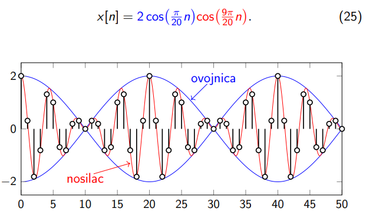

$$
y[n]=2 \cos \left(\frac{\omega_2-\omega_1}{2}\left(n+\overbrace{\frac{\phi(\omega_2)-\phi(\omega_1)}{\omega_2-\omega_1}}^{\approx \color{blue}{\tau_g}}\right)\right) \cdot \cos \left(\frac{\omega_1+\omega_2}{2}\left(n+\underbrace{\frac{\phi(\omega_1)+\phi(\omega_2)}{\omega_1+\omega_2}}_{\approx \color{red} \tau_\phi}\right)\right) \\
$$

$\textcolor{red}{\tau_\phi}$ je fazno kašnjenje (nosioca)
$\textcolor{blue}{\tau_g}$ je grupno kašnjenje (ovojnice)

Grupno vrijeme kašnjenja jest negativna derivacija fazno-frekvencijske karakteristike:

$$\textcolor{blue}{\tau_g(\omega)} = - \frac{\partial \phi(\omega)}{\partial \omega}$$

Idealno grupno vrijeme kašnjenje za filtre savršeno linearne faze je konstantno. Za dizajnirani IIR filtar stoga želimo da grupno vrijeme kašnjenje u području propuštanja bude što bliže konstanti. Grupno kašnjenje u području gušenja nas ne zanima jer se te frekvencije uklanjaju iz signala.

Primijetite sljedeće:
- Sustavi s linearnom fazom imaju konstantno i grupno i fazno kašnjenje.
- Grupno kašnjenje možemo koristiti kao približnu mjeru faznih izobličenja; značajna promjenljivost grupnog kašnjenja znači da su fazna izobličenja moguća
- grupno i fazno kašnjenje poprimaju NEcjeloborne vrijednosti što otežava njihovu primjenu i interpretaciju u praksi

Definirajte amplitudno selektivnu filtraciju i objasnite osnovne amplitudno selektivne filtre (NP, VP, PP i PB).

### Svepropusni filtar

Onaj koji ne utječe na amplitudno frekvencijsku karakteristiku već samo na faznu. Zbog toga se nazivaju i korektori faze. Ovaj sustav ima recipročne polove (unutar jedinične kružnice) i nule (izvan jedinične kružnice).

### Dizajniranje amplitudno-selektivnih IIR filtara

Kod klasičnog dizajna filtara (i digitalnih i analognih) postupak dizajniranja se razdvaja u dva koraka:
1. dizajniranje amplitudno-selektivnog filtra
2. dizajniranje faznog korektora.

Takvo razdvajanje dizajna u dva odvojena koraka se temelji na činjenici da svaku prijenosnu funkciju stabilnog i kauzalnog filtra možemo jednoznačno rastaviti na kaskadu (produkt prijenosnih funkcija) **minimalno-faznog filtra** (engl. *minimum-phase filter*) i **svepropusnog filtra** (engl. *all-pass filter*), odnosno

$$H(z)=H_{MP}(z)H_{A}(z).$$

Minimalno-fazni filtar $H_{MP}(z)$ je određen time da su svi njegovi polovi i sve njegove nule unutar jedinične kružnice. Osim toga, amplituda i faza prijenosne funkcije $H_{MP}(e^{j\omega})$ su povezani [Hilbertovom transformacijom](https://ccrma.stanford.edu/~jos/sasp/Minimum_Phase_Filter_Design.html), odnosno ako je zadana amplitudna karakteristika $|H_{MP}(e^{j\omega})|$ onda iz nje možemo jednoznačno odrediti faznu karakteristiku $\angle H_{MP}(e^{j\omega})$, i obrnuto.

Svepropusni filtar $H_{A}(z)$ je određen time da ne utječe na amplitudni spektar signala, odnosno za njega vrijedi $|H_{A}(e^{j\omega})|=1$, dok fazna karakteristika ovisi isključivo o položajima nula izvan jedinične kružnice. Prema tome svepropusni filtar utječe samo na fazu signala. On ima recipročne polove (unutar jedinične kružnice) i nule (izvan jedinične kružnice) (omjer mora biti 1 da ne mijenja amplitudu).

Ova mogućnost rastava prijenosne funkcije znači da bilo koji IIR filtar možemo prikazati preko minimalno-faznog dijela koji u potpunosti određuje amplitudnu karakteristiku filtra, te preko svepropusnog dijela koji dodatno određuje faznu karakteristiku.

$$
\begin{aligned}
|H(e^{j\omega}) & = |H_{MP}(e^{j\omega})| \\
\angle H(e^{j\omega}) & = \angle H_{MP}(e^{j\omega}) + \angle H_A(e^{jw})
\end{aligned}
$$

## Četiri tipa amplitudno-selektivnih filtara

Četiri tipa amplitudno-selektivih filtara obzirom na oblik željene **amplitudne karakteristike**:

1. nisko-propusni ili NP filtar,
2. visoko-propusni ili VP filtar,
3. pojasno-propusni ili PP filtar, i
4. pojasnu branu (PB).

Odgovarajuće kratice u engleskom jeziku su LP za nisko-propusni filtar, od engl. *low-pass*, HP za visoko-propusni filtar, od engl. *high-pass*, BP za pojasno-propusni filtar, od engl. *band-pass*, i BS za pojasnu branu, od engl. *band-stop*.

**Nisko-propusni** filtar propušta frekvencije manje od granične frekvencije $\omega_c$. Frekvencije od $0$ d $\omega_c$ su propuštene zbog čega se raspon frekvencija $[0,\omega_c\rangle$ naziva **područjem propuštanja**. Frekvencije of $\omega_c$ do $\pi$ su ugušene (zaustavljene) zbog čega se to frekvencijsko područje $\langle \omega_c,\pi\rangle$ naziva **područjem gušenja**. Ostvarivi (realizabilni) filtri ne mogu imati beskonačno strm prijelaz iz područja propuštanja u područje gušenja pa zbog toga uvijek postoji neko **prijelazno područje** oko granične frekvencije $\omega_c$.

**Visoko-propusni** filtar guši frekvencije manje od granične frekvencije $\omega_c$. U odnosu na nisko-propusni filtar iste granične frekvencije kod visoko-propusnog filtra područje propuštanja i područje gušenja su zamijenjeni.

**Pojasno-propusni** filtar propušta samo frekvencije unutar odabranog frekvencijskog pojasa $\langle\omega_L,\omega_H\rangle$.

**Pojasni brana** gušiti sve frekvencije unutar odabranog frekvencijskog pojasa $\langle\omega_L,\omega_H\rangle$. Pojasne brane s uskim područjem gušenja zovemo **zapornim** filtrima (engl. *notch filter*); digitalni zaporni filtri najčešće imaju jednu ili više nula na jediničnoj kružnici točno unutar njihovog uskog pojasa gušenja.

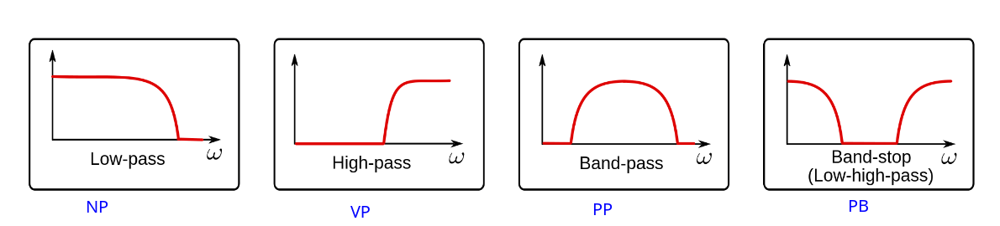

Ostali tipove filtara koji ne odgovaraju nekom od standardna četiri tipa amplitudno-selektivnih filtara možemo dizajnirati klasičnim postupkom samo ako se njihova amplitudna karakteristika može iskazati kao kombinacija standardnih NP, VP, PP i PB filtara, bilo kao njihov paralelni spoj (zbroj prijenosnih funkcija) bilo kao njihov kaskadni spoj (produkt prijenosnih funkcija).

Definirajte FIR filtre te objasnite kako pomoću njih ostvarujemo filtraciju bez faznih izobličenja.

FIR smo već definirali gore.

tldr; tako da impulsni odziv tih filtara zadovoljava svojstvo simetrije ili antisimetrije,

## Položaj nula

Svaki digitalni filtar u potpunosti je opisan položajem vlastitih polova i nula. FIR filtri nemaju ne-trivijalnih polova što znači da samo nule utječu na njihovu frekvencijsku karakteristiku. Prema tome kod FIR filtara nas zanima isključivo položaj vlastitih nula.

Znamo da ako je impulsni odziv realan onda su nule digitalnog filtra ili čisto realne ili su sparene u konjugirano-kompleksne parove.

Također, nula filtra postavljena na jediničnu kružnicu $z=e^{j\omega}$ na frekvenciju $\omega_0$ uzrokuje da amplitudna karakteristika na $\omega_0$ postane jednaka nuli. U tom slučaju kažemo da filtar u potpunosti **zatire** odabranu frekvenciju.

## Položaj nula kod FIR filtara generalizirane linearne faze

Kod određivanja položaja nula od posebnog interesa su **FIR filtri generalizirane linearne faze**. Impulsni odziv tih filtara zadovoljava svojstvo simetrije ili antisimetrije.

$$h[n]=\pm h[M-n].$$

To znači da su prvi i zadnji koeficijent jednaki, drugi i predzadnji jednaki, itd... Gore navedeno svojstvo impulsnog odziva omogućava nam da prijenosnu funkcija filtra izrazimo na dva različita načina,

$$H(z)=\sum_{n=0}^{M}h[n]z^{-n}=\sum_{n=0}^{M}\pm h[M-n]z^{-n}.$$

Zamjena varijable $m=M-n$ sada daje

$$H(z)=\sum_{n=0}^{M}\pm h[M-n]z^{-n}=\sum_{m=0}^{M}\pm h[m]z^{-M+m}=z^{-M}\sum_{m=0}^{M}\pm h[m]z^{m}.$$

Također vrijedi

$$\sum_{m=0}^{M}h[m]z^{m}=H(z^{-1}),$$

pa na kraju dobivamo

$$H(z)=\pm z^{-M}H(z^{-1}).$$

Polinome $H(z)$ s realnim koeficijentima koji zadovoljavu gore navedene uvjete obično zovemo polinomima sa zrcalnim koeficijentima. U engleskoj literaturi se još preciznije koriste izrazi **mirror-image polynomial** i **antimirror-image polynomial**.

Za takav polinom vrijedi da ako je $z_0$ njegova nula onda je i $1/z_0$ također njegova nula.

To svojstvo proizlazi odmah iz $H(z)=\pm z^{-M}H(z^{-1})$ jer za $z_0\neq 0$ imamo $H(z_0)=0=z_0^{-M}H(z_0^{-1})$ što vrijedi samo ako je $H(z_0^{-1})=0$.

**Navedeno ograničenje položaja nula FIR filtra linearne faze je očekivano obzirom na to da simetrija ili antisimetrija pripadajućeg impulsnog odziva smanjuje broj stupnjeve slobode u optimizacijskom problemu na pola. Prema tome kada bi dizajnirali takve filtre korištenjem reprezentacije preko nula, polova i pojačanja onda je samo dio nula slobodno raspoređen i podložan optimizaciji, a preostale nule su unaprijed ograničene uvjetima koji ih sparuju u konjugirano-kompleksne i u recipročne parove.**

Definirajte IIR filtre te objasnite njihove prednosti i nedostatke u odnosu na FIR filtre.

FIR prednosti:
- bezuvjetna stabilnost;
- precizna kontrola fazne karaketeristike (linearnost faze);
- optimalni algoritmi za dizajniranje
- robusniji što se tiče numeričke preciznosti (nazivnik je 1)

FIR Mane:
- dulje input-output kašnjenje;
- skuplje za računski izračunati

IIR prenosti:
- brže se računaju
- kraće input-output kašnjenje
- kompaktna reprezentacija

IIR Mane:
- stabilnost nije garantirana (nazivnik može biti ne-jedan, tj. polovi nisu trivijalni)
- fazni oddziv nije lako kontrolirati
- osjetljiv na numeričke preciznosti

### Primjene

Definirajte brzu Fourierovu transformaciju (FFT) i navedite njenu asimptotsku složenost.

Objasnite razliku između linearne i cirkularne konvolucije te objasnite kako koristimo FFT za efikasno računanje linearne konvolucije konačnih signala.

Objasnite razliku između linearne i cirkularne korelacije te objasnite kako koristimo FFT za efikasno računanje linearne korelacije konačnih signala.

Navedite nekoliko problema aritmetike konačne preciznosti te detaljno objasnite kako možemo otkloniti problem preljeva.

